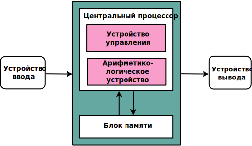
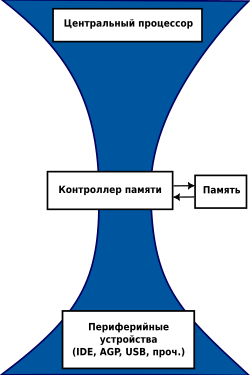
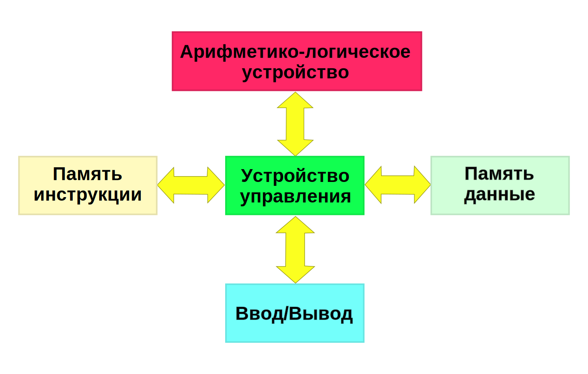
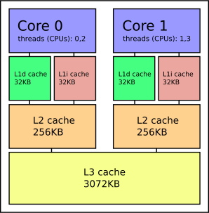

# 1 - Трансляторы, Интерпретаторы и Байт-код

## Список тем:

- **Архитектуры компьютеров:** Архитектура фон Неймана, Гарвардская архитектура, Bottleneck, Риски безопасности, проблема когерентность памяти, где какой тип архитектуры используется?
- **Кэш процессора:** Что такое кеширование? Зачем нужны три уровня кэша (L1, L2, L3)? Кэш процессора размером 1ТБ?: SRAM/DRAM, скорость доступа, ...
- **Python процесс трансляции:** Lexer, Parser, Semantic Analysis, байт-код и где он исполняется? **Что такое:** токены из кода, AST, .pyc? **Модули:** tokenize, ast, mypy, dis, py_compile, marshal? Директория: `__pycache__`? Объект класса code?
- **Python байт-код:** компиляция или трансляция? В чём его отличие от двоичного представления? Как увидеть байт-код? Байт-код и архитектура компьютера. От чего зависит вид байт-кода, один и тот же ли он под конкретную реализацию языка Python? Как исполняется байт-код?
- **PVM:** что это и какую роль играет? При чём тут GC и управление ресурсами?
- **JIT:** Что это, как работает и зачем нужно? Этапы. Что такое 'горячие точки' и причём тут кэширование? Недостатки JIT: время запуска, память, сложность.
- **Что такое:** CPython / Cython, PyPy, Jython, GraalPy, Nogil, Pyodide, Brython, MicroPython?
- **Что такое:** GIL?
_________
## ***Архитектуры компьютеров***

Архитектура фон Неймана и архитектура Гарварда — это две основные модели компьютерной архитектуры, которые описывают, как организованы память и процессорные устройства компьютера. Эти архитектуры являются основой большинства современных вычислительных систем.

**TL;DR**: _Архитектура фон Неймана_ использует общее пространство памяти для данных и инструкций, проста и дёшево реализуется, но страдает от узкого места – ограничений пропускной способности памяти. _Гарвардская архитектура_ применяет раздельные пути для данных и инструкций, обеспечивая высокую производительность и используется в системах реального времени, встроенных устройствах и DSP.

### Архитектура фон Неймана

Модель фон Неймана описывает архитектуру компьютера, в которой и программные инструкции, и данные хранятся в одной и той же области памяти.

##### Основные характеристики:

- ***Единое пространство памяти:*** Инструкции (код) и данные хранятся в одной и той же памяти. Это означает, что процессор извлекает и инструкции, и данные из одной общей памяти.
- ***Последовательное выполнение:*** Инструкции извлекаются из памяти и выполняются одна за другой в последовательном порядке. Следующая инструкция извлекается только после выполнения текущей.
- ***Управляющее устройство и ALU (Arithmetic Logic Unit)*:** Процессор обычно включает управляющее устройство, которое интерпретирует инструкции, и ALU, которое выполняет математические операции. Оба устройства используют общий шину памяти для доступа к инструкциям и данным.
- ***Бутылочное горлышко фон Неймана***: Существенное ограничение заключается в том, что инструкции и данные не могут извлекаться одновременно, поскольку они используют один и тот же путь передачи данных. Это создает узкое место, ограничивая скорость выполнения инструкций процессором, так как ему постоянно приходится переключаться между доступом к данным и извлечением инструкций.

##### Преимущества:

- ***Простота модели:*** Хранение данных и инструкций в одном месте упрощает управление памятью. Не нужно думать о разделении или организации различных типов памяти, что уменьшает сложность системы. Процессор использует одну шину для доступа к обоим типам информации.
	- *Пример:* Представьте, что у вас есть книга рецептов, в которой и сами рецепты (инструкции), и ингредиенты (данные) хранятся на одной полке. Вам не нужно идти в два разных места, чтобы получить инструкции по приготовлению и ингредиенты — всё, что нужно, находится вместе, в одном удобном месте.
- ***Экономичность:*** Использование одной общей памяти и единых каналов передачи данных означает, что нет необходимости в установке дополнительных модулей памяти или сложных маршрутов передачи данных. Это сокращает количество аппаратных деталей, что уменьшает затраты на производство таких систем.
- ***Гибкость:*** Гибкость архитектуры заключается в том, что единая модель памяти упрощает проектирование и программирование универсальных компьютеров. Благодаря этому одна и та же архитектура может справляться с разными типами задач и инструкций без необходимости использования специализированного оборудования для каждой операции.

##### Недостатки:

- ***Bottleneck:*** Совместное использование шины (канала передачи данных) для инструкций и данных создает узкое место, ограничивая доступ к памяти, так как в каждый момент можно получить доступ только к одному элементу данных или инструкции, что снижает производительность процессора. 

  Это решается усовершенствованием систем кэширования, что усложняет архитектуру и увеличивает риск ошибок, таких как проблема когерентности памяти (см. Кеши процессора).

- ***Риски безопасности:*** Совместное хранение кода и данных в одной памяти упрощает вредоносному коду изменение инструкций программы или данных: Injection Attacks, Buffer Overflow и другие.
##### Где используется:

- Архитектура фон Неймана широко используется в компьютерах общего назначения, таких как настольные компьютеры, ноутбуки и серверы.
- Большинство современных процессоров, включая процессоры x86, основаны на модели фон Неймана.

### Гарвардская архитектура

Гарвардская архитектура - альтернативная архитектура компьютера, в которой инструкции и данные хранятся и передаются отдельно.

##### Основные характеристики:
- ***Раздельная память:*** Инструкции (код) и данные хранятся в разных местах (память) и используют отдельные шины (каналы передачи данных) и адресные пространства (диапазон адресов памяти).
##### Преимущества:

- ***Параллельность и скорость:*** CPU может одновременно получать инструкции и данные, устраняя узкие места, как в архитектуре фон Неймана, что позволяет быстрее обрабатывать информацию, поскольку не нужно ждать доступа к памяти.
- ***Большая безопасность:*** поскольку инструкции и данные хранятся отдельно, вредоносному коду сложнее изменить инструкции программы, что обеспечивает более безопасное выполнение.
- ***Специализация:*** различные архитектуры памяти и методы доступа могут быть оптимизированы для инструкций и данных независимо друг от друга, что обеспечивает большую гибкость и настройку производительности.
##### Недостатки:

- ***Сложность:*** конструкция требует отдельных блоков памяти и шин для инструкций и данных, что увеличивает сложность и стоимость.
- ***Меньшая гибкость:*** изменение набора инструкций или конфигурации хранилища данных может быть более сложным и менее гибким по сравнению с архитектурой фон Неймана.

##### Где используется:

- Широко используется во встраиваемых системах, микроконтроллерах и цифровых сигнальных процессорах (DSP), где эффективность и скорость имеют решающее значение.
- Распространено в средах обработки в реальном времени, где требуется предсказуемое выполнение и высокая производительность.

__________
## ***Кэши процессора***

**TL;DR**: *Кэш процессора (CPU cache)* – это высокоскоростная память, встроенная в процессор, для временного хранения часто используемых данных и инструкций. Он снижает задержки доступа к оперативной памяти (RAM), которая медленнее процессора. Кеш делится на три уровня, встроенных в сам процессор или расположенных рядом с ним: *L1* – самый быстрый и маленький, *L2* и *L3* – больше по объёму, но медленнее.

***Кеширование*** – эффективная стратегия управления памятью, используемая для повышения производительности компьютерных систем. Оно временно сохраняет часто используемые данные в быстро доступной памяти, что сокращает время доступа к ним и улучшает общую скорость работы системы.

Три уровня кэша используются для оптимального баланса между скоростью, стоимостью и размером:
- ***L1-кэш*** находится ближе всего к процессору и работает на очень высокой скорости, почти на той же частоте, что и сам процессор. Однако его размер ограничен (обычно от 32КБ до 128КБ), так как он должен быть очень быстрым и компактным. Этот кэш используется для хранения данных, к которым процессор обращается чаще всего. Одна часть хранит инструкции, вторая - данные.
-  ***L2-кэш*** больше по размеру (обычно от 256КБ до 1МБ) и медленнее, чем L1, но всё равно значительно быстрее основной памяти (RAM). Он используется для хранения данных, к которым процессор обращается не так часто, как к данным в L1, но всё же достаточно регулярно, чтобы не загружать их из основной памяти.
- ***L3-кэш*** имеет наибольший объем (обычно от нескольких мегабайт до десятков мегабайт) и является самым медленным из всех уровней кэша, но всё ещё значительно быстрее основной памяти. Он служит общим буфером для всех ядер процессора и хранит данные, которые могут быть полезны для выполнения задач в ближайшем будущем, но еще не были загружены в L1 или L2.

**Когерентность памяти** – это свойство многопроцессорных систем, где изменения в ячейке памяти, сделанные одним ядром, становятся видимыми для других. В одноядерных системах изменения видны сразу. В многопроцессорных системах используется протокол когерентности, чтобы обновления одним ядром синхронизировались с кешами других ядер, обеспечивая согласованность данных.

#### Почему нельзя создать кэш размером 1ТБ? SRAM/DRAM

- ***Стоимость:*** Кэш-память основана на технологиях быстрой памяти (обычно *SRAM*: static random-access memory), которые значительно дороже в производстве, чем стандартная *DRAM* (dynamic RAM), используемая для основной памяти (RAM).
- ***Энергопотребление:*** Кэш-память потребляет больше энергии, чем основной тип оперативной памяти. Большой кэш, особенно размером 1ТБ, привел бы к значительному увеличению потребления энергии.
- ***Замедление доступа:*** Несмотря на то что кэш быстрее оперативной памяти, увеличение его объема до терабайта сделало бы его менее эффективным. Доступ к кэшу требует поиска нужных данных, и чем больше кэш, тем дольше будет процесс поиска нужной информации.
- ***Управление кэшем:*** С увеличением размера кэша сложность управления данными и координации между кэшем и оперативной памятью также возрастает. Для работы с кэшем необходимы алгоритмы вытеснения (например, LRU — Least Recently Used), которые отслеживают, какие данные должны быть сохранены, а какие — удалены. В кэше объемом 1ТБ эти алгоритмы станут сложнее и будут занимать больше ресурсов.

_______________
## ***Python процесс трансляции***

[TODO]

_________________
## ***Python байт-код***

[TODO]

__________
## ***PVM***

[TODO]

______________
## ***JIT-компиляция***

**TL;DR**: *JIT-компиляция* ускоряет выполнение программы, компилируя часто используемые участки – *горячие точки* – в машинный код во время исполнения. Когда байт-код интерпретируется на виртуальной машине, при выявлении горячих точек они компилируются и кешируются, чтобы последующие вызовы шли быстрее. JIT-компиляция даёт прирост производительности, но поначалу увеличивает задержку запуска программы и расход памяти.

***Just in-time compilation*** - это метод выполнения компьютерного кода, который включает компиляцию во время выполнения программы, а не до её выполнения. Идея заключается в том, чтобы скомпилировать код как раз вовремя для его запуска, отсюда и название. JIT-компиляторы работают с промежуточными представлениями кода, такими как байт-код, и компилируют его в нативный машинный код на лету.

#### Этапы JIT компиляции

1. ***Компиляция исходного кода в байт-код***
2. ***Интерпретационное исполнение***:  читает инструкции байт-кода и выполняет их одну за другой на виртуальной машине
3. ***Выявление часто выполняемого кода:*** этот этап помогает определить, какие участки кода больше всего выиграют от компиляции в машинный код. Cреда выполнения отслеживает *“горячие точки”*: циклы, часто вызываемые методы или критические пути кода (участки программы, которые оказывают наибольшее влияние на общую производительность системы, так как они выполняются наиболее часто или требуют значительных вычислительных ресурсов).
4. ***Компиляция “на лету” в машинный код:*** Когда обнаруживается "горячая точка", JIT-компилятор берёт эту часть байт-кода и компилирует её в машинный код во время выполнения программы. Затем машинный код выполняется непосредственно CPU. Скомпилированный код кешируется, поэтому в следующий раз, когда будет выполнена та же самая "горячая точка", среда выполнения сможет напрямую использовать оптимизированный машинный код.
5. ***Методы оптимизации:***  JIT-компиляторы часто применяют различные техники оптимизации в процессе выполнения, такие как:
	- *Встраивание (Inlining)*: Замена вызова функции на фактический код этой функции для уменьшения накладных расходов на вызов.
	- *Развёртывание циклов (Loop unrolling)*: Расширение цикла для минимизации накладных расходов на проверку условия цикла.
	- *Устранение мёртвого кода (Dead code elimination)*: Удаление кода, который не влияет на результат работы программы.
	Эти оптимизации основаны на фактических данных времени выполнения, что может быть более эффективным по сравнению со статическими оптимизациями на этапе компиляции.
6. ***Адаптивная перекомпиляция:*** Если среда выполнения обнаруживает изменения в профиле исполнения (например, разные части кода становятся "горячими точками"), JIT-компилятор может повторно перекомпилировать участки кода с использованием различных оптимизаций, адаптируясь к изменяющимся условиям и обеспечивая максимально эффективную работу программы.

#### Преимущества JIT-компиляции

- ***Оптимизация производительности:*** JIT-компиляция позволяет программе работать быстрее, поскольку она компилирует часто выполняемый код в машинный код, который процессор выполняет намного быстрее, чем интерпретируемый байт-код.
- ***Независимость от платформы:***  Исходный код сначала компилируется в байт-код, который является универсальным набором инструкций, понятных виртуальной машине. Таким образом, этот байт-код может выполняться на любой платформе, где доступна совместимая JIT среда выполнения, обеспечивая абсолютную независимость от аппаратной архитектуры.
- ***Динамическая оптимизация:***  JIT-компиляция позволяет проводить оптимизацию на основе фактических шаблонов выполнения. Компилятор может принимать решения, используя данные в реальном времени, что приводит к лучшей оптимизации, чем та, которая возможна при статической компиляции.
- ***Улучшенное управление ресурсами:***  Сосредоточившись на горячих точках, JIT-компиляция эффективно использует ресурсы, избегая необходимости компилировать всю программу в машинный код сразу. Это помогает эффективнее управлять памятью и временем обработки.
#### Недостатки JIT-компиляции

- ***Время запуска:***  Первоначально программы, использующие JIT-компиляцию, могут работать медленнее, чем полностью скомпилированные программы, поскольку интерпретатор используется до того, как будут идентифицированы и скомпилированы «горячие точки».
- ***Использование памяти:***  JIT-компиляция требует дополнительной памяти для хранения скомпилированного машинного кода, что может увеличить общий объем памяти, занимаемый программой.
- ***Сложность:***  Реализация JIT-компиляторов сложна и требует сложных методов обнаружения горячих точек и оптимизации кода в реальном времени. Эта сложность может привести к увеличению времени разработки и отладки следующих версий.

