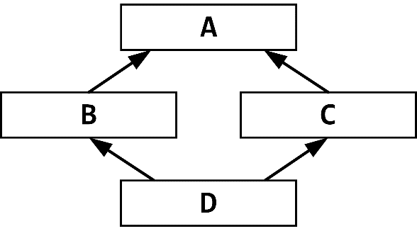

# Adv ООП

## Список тем:

- **dunder methods**: `__new__`, `super().__new__(cls, ...)`, `__del__`
- **Singleton**, generic via `__class_getitem__`  
- **not/subscriptable object**:`__class_getitem__` v/s`__getitem__`/`__setitem__`/`__delitem__`, цикл for: `__getitem__` & IndexError  
- **iterable object**: `__getitem__`, `__iter__`, `__next__`, `StopIteration`
- **Context manager**: `__enter__`, `__exit__`: `exc_type`, `exc_value`, `traceback`, языковая конструкция `with`
- **Descriptors**: data descriptor v/s non-data descriptor, `__get__`, `__set__`, `__delete__` v/s `__del__`, `__set_name__`, `@property` как data descriptor  
- **Доступ к атрибутам объекта**: `__getattribute__`, `__getattr__`/`__setattr__`/`__delattr__`, как избежать 'бесконечной' рекурсии .
- `super(type, object_or_type=None)`: прокси-объект: `__thisclass__`, `__self__`, `__self_class__`; `mappingproxy` & `TypeError`
- **MRO**: Ромбовидное наследование / diamond problem, C3 линеаризация
- `type(name, bases, dict)`: метаклассы и их создание, динамическое создание классов 
- **Миксин**
______
## `__new__`, `super().__new__(cls, ...)`, `__del__`

`__new__` – статический метод, который создаёт новый экземпляр класса. Вызывается перед `__init__` и отвечает за выделение памяти.
Сигнатура: `__new__(cls, *args, **kwargs)`
- в качестве первого аргумента получает класс (`cls`)
- возвращает новый экземпляр класса (`cls`),
	  - если возвращает экземпляр другого класса или `None`, метод `__init__` не будет вызван
- большинство реализаций `__new__` включают вызов метода `__new__` суперкласса с использованием `super().__new__(cls, ...)` для обеспечения правильного создания экземпляра.
- применение:
	  - создание подклассов неизменяемых типов
	  - необходимость контролировать процесс создания экземпляра

```Python
class MyClass:  
    def __new__(cls, *args, **kwargs):  
        print(f"__new__ called with cls={cls}, args={args}, kwargs={kwargs}")  
        instance = super().__new__(cls)  
        return instance  
  
    def __init__(self, value):  
        print(f"__init__ called with self={self}, value={value}")  
        self.value = value  
  
# Creating an instance of MyClass  
obj = MyClass(10)
```
```output
__new__ called with cls=<class '__main__.MyClass'>, args=(10,), kwargs={}
__init__ called with self=<__main__.MyClass object at 0x00000167B945D9A0>, value=10
```

`__del__` – деструктор. Вызывается, когда объект собирается быть уничтоженным, что обычно происходит, когда его счетчик ссылок падает до нуля, и исполняет `__del__` класса перед удалением объекта.
- используется для выполнения действий по очистке:
    - закрытие файлов
    - освобождение ресурсов, перед удалением объекта из памяти.

```Python
class MyClass:  
    def __init__(self, name):  
        self.name = name  
        print(f"{self.name} created.")  
  
    def __del__(self):  
        print(f"{self.name} is being destroyed.")  
  
# Создание и удаление экземпляра  
obj = MyClass("Object1")  # Object1 created.
del obj  # Вызывает __del__; Object1 is being destroyed.
```

- Во время завершения работы интерпретатора Python методы `__del__` могут не вызываться или вызываться в непредсказуемом порядке.
- Если внутри `__del__` возникло исключение, оно игнорируется, а в sys.stderr (стандартный поток вывода ошибок в терминале Linux) выводится предупреждение.

___________
## **Singleton**, generic via `__class_getitem__`

### Singleton

*Синглтон* – паттерн, гарантирующий создание только одного экземпляра класса.
Может быть реализован как с помощью `__new__`, или как метакласс или декоратор.

Простейший пример с `__new__`:
```Python
class Singleton:  
    _instance = None  
  
    def __new__(cls, *args, **kwargs):  
        if cls._instance is None:  
            cls._instance = super().__new__(cls)  
        return cls._instance  # WARN! По идее тут всегда вызывается __init__
  
s1 = Singleton()  
s2 = Singleton()  
print(s1 is s2)  # True
```

Пример посложнее (тут поаккуратнее с инициализацией):
```Python
class Singleton:  
    _instance = None  
  
    def __new__(cls, *args, **kwargs):  
        if cls._instance is None:  
            print("Создание нового экземпляра")  
            cls._instance = super().__new__(cls)  
            cls._instance._initialized = False  
        else:  
            print("Используем существующий экземпляр")  
  
        return cls._instance  
  
    def __init__(self, value):  
        if not hasattr(self, '_initialized') or not self._initialized:  
            print(f"Инициализация с value={value}")  
            self.value = value  
            self._initialized = True  
  
a = Singleton(1) # Создание нового экземпляра; Инициализация с value=1  
b = Singleton(2) # Используем существующий экземпляр  
print(a.value, b.value, a is b) # 1, 1, True
```

### Generic с помощью `__class_getitem__`

`__class_getitem__(cls, item)` – метод для поддержки параметризации типов на уровне класса (например, `SomeClass[int]`), используется в аннотациях типов.

```Python
class MyList:  
    @classmethod  
    def __class_getitem__(cls, item):  
        return f"{cls.__name__}[{item}]"  
    print(MyList[int]) # MyList[<class 'int'>]
```

_________
## **not/subscriptable object**

### `__class_getitem__` v/s`__getitem__`/`__setitem__`/`__delitem__`

`__class_getitem__` работает на уровне класса для параметризации типов, не делает экземпляры индексируемыми.

Методы `__getitem__`, `__setitem__`, `__delitem__` делают экземпляры класса индексируемыми (subscriptable), т.е. позволяют:
- объектам использовать синтаксис индексации и среза
- пользовательским классам вести себя как встроенные типы контейнеров, такие как списки, словари и кортежи

```python
__getitem__  # ~ obj[key]
```

- вызывается для извлечения элемента из obj
- Mapping Types: по ключу; Sequence Types: по индексу
- Custom Container: можно определить любую логику для обработки ключей

```python
__setitem__  # ~ obj[key] = value
```

- вызывается для присвоения значения элементу из obj по ключу/индексу
- Mapping Types: добавляют/обновляют пары ключ-значение
- Sequence Types: изменяют существующие элементы (изменяют ссылки)

```python
__delitem__  # ~ del obj[key]
```

- вызывается для удаления элемента из контейнера через ключ/индекс
- Mapping Types: удаляют пары ключ-значение
- Sequence Types: удаляют элементы по индексу

Пример:
```Python
class MyList:  
    def __init__(self, initial):  
        self.data = initial if initial is not None else []  
  
    def __getitem__(self, item):  
        return self.data[item]  
  
    def __setitem__(self, key, value):  
        self.data[key] = value  
  
    def __delitem__(self, key):  
        del self.data[key]  
  
    def __repr__(self):  
        return repr(self.data)  
  
l = MyList([1, 2, 3, 4, 5])  
print(l[3]) # 4  
  
l[2] = 7  
print(l) # [1, 2, 7, 4, 5]  
  
del l[0]  
print(l) # [2, 7, 4, 5]
```

### Цикл for: `__getitem__` и `IndexError`

Если объект реализует `__getitem__` , цикл for вызывает его с возрастающими индексами, пока не получит IndexError.

```Python
class CountUp:  
    def __getitem__(self, index):  
        if index < 5:  
            return index  
        raise IndexError  
  
for num in CountUp():  
    print(num, end=' ')  # 0 1 2 3 4
```
_______
## **iterable object**

Как сказано выше, можно сделать объект итерируемым через `__getitem__`.

А чтобы использовать итераторы есть методы `__iter__` и `__next__`:

**Итерация** — процесс последовательного доступа к элементам коллекции, обычно через цикл `for`.

**Итерируемый объект** — объект, способный возвращать свои элементы поочередно. Объект считается итерируемым, если он реализует метод `__iter__()` или метод `__getitem__()`

`__iter__` возвращает объект итератора, в котором есть `__next__`, необходим для работы цикла `for`.

`__next__` возвращает следующий элемент или исключение `StopIteration`, если следующего элемента нет.

**Цикл `for`:**
- вызывает `iter()` для итерируемого объекта
- вызывает `next()`, извлекая элементы, пока не получит `StopIteration`
- для повторной итерации нужно создать новый итератор

```Python
class CountUpIterator:  
    def __init__(self):  
        self.current = 0  
  
    def __iter__(self):  
        return self  
  
    def __next__(self):  
        if self.current < 5:  
            result = self.current  
            self.current += 1  
            return result  
        raise StopIteration  
  
for num in CountUpIterator():  
    print(num, end=' ') # 0 1 2 3 4 5
```
```Python
class BinaryTreeNode:  
    def __init__(self, value):  
        self.value = value  
        self.left = None  
        self.right = None  
  
class BinaryTree:  
    def __init__(self, root):  
        self.root = root  
  
    def __iter__(self):  
        return self.InOrderIterator(self.root)  
  
    class InOrderIterator:  
        def __init__(self, node):  
            self.stack = []  
            self.current = node  
  
        def __iter__(self):  
            return self  
  
        def __next__(self):  
            while self.current is not None:  
                self.stack.append(self.current)  
                self.current = self.current.left  
  
            if not self.stack:  
                raise StopIteration  
  
            node = self.stack.pop()  
            value = node.value  
            self.current = node.right  
            return value  
  
if __name__ == "__main__":  
    root = BinaryTreeNode(1)  
    root.left = BinaryTreeNode(2)  
    root.right = BinaryTreeNode(3)  
    root.left.left = BinaryTreeNode(4)  
    root.left.right = BinaryTreeNode(5)  
  
    tree = BinaryTree(root)  
  
    for value in tree:  
        print(value, end=' ') # 4 2 5 1 3
```

_______
##  **Context manager**

**Контекстный менеджер** – объект, автоматически управляющий ресурсами через их открытие и закрытие. Работает с языковой конструкцией `with`.

Конструкция `with` в Python используется для управления ресурсами, такими как файлы, соединения с базами данных и другие объекты, которые требуют явного открытия и закрытия. Она обеспечивает автоматическое управление этими ресурсами, гарантируя, что они будут корректно закрыты после использования, даже если внутри блока `with` произойдет исключение.

Методы `__enter__` и `__exit__` позволяют классу реализовать протокол контекстного менеджера:
- метод `__enter__` вызывается при входе в блок `with`:   `object.__enter__(self)`
- должен вернуть объект, который будет привязан к переменной после ключевого слова `as`, если оно указано

- метод `__exit__` вызывается при выходе из блока `with`
- принимает три аргумента, которые описывают возможное исключение, возникшее внутри блока `with`. Если исключение не произошло, все три аргумента будут `None`
- `object.__exit__(self, exc_type, exc_value, traceback)`
    - `exc_type` — тип исключения
    - `exc_value` — значение исключения
    - `traceback` — объект, с трассировкой вызова

```Python
class FileContextManager:  
    def __init__(self, filename):  
        self.filename = filename  
  
    def __enter__(self):  
        self.file = open(self.filename, 'w')  
        return self.file  
  
    def __exit__(self, exc_type, exc_value, traceback):  
        if self.file:  
            self.file.close()  
        if exc_type:  
            print(f"Исключение: {exc_type}")  
            return False  # Пропускает исключение  
  
with FileContextManager('example.txt') as file:  
    file.write('Hello, world!')
```

__________
## **Descriptors**

**Дескрипторы** — это объекты, которые реализуют один или несколько методов специального протокола (`__get__`, `__set__`, `__delete__`). Они определяют поведение доступа, установки и удаления атрибута. Дескрипторы работают, когда их экземпляры объявлены как атрибуты в теле класса.

**Примеры встроенных дескрипторов:**
- **Методы класса** (`@classmethod`) — возвращают метод, привязанный к классу, а не к экземпляру.
- **Статические методы** (`@staticmethod`) — возвращают обычную функцию, не привязанную ни к экземпляру, ни к классу.
- **Свойства** (`@property`) — позволяют определять поведение при доступе к атрибуту как к обычному полю, при этом вызывается метод (`getter`, `setter`, `deleter`).
### Data descriptor v/s Non-Data descriptor

- **data descriptor**: определяют методы `__get__()`, `__set__()` и/или `__delete__()`. Имеют приоритет над атрибутами экземпляра при разрешении атрибутов и могут переопределять значения, находящиеся в `__dict__` экземпляра.
- **non-data descriptor**: определяют только метод `__get__()`. Могут быть переопределены атрибутами экземпляра, так как имеют более низкий приоритет при разрешении атрибутов.

#### Механизм работы дескрипторов на примере `__get__`

Когда вы обращаетесь к атрибуту объекта, Python выполняет следующие шаги:
1. Проверяется, является ли атрибут `data descriptor`.
	   - Если да, вызывается `__get__()`
2. Если в `__dict__` экземпляра есть такое имя, возвращается связанное значение
3. Если атрибут является `non-data descriptor`, вызывается `__get__()`
4. Атрибуты класса: если в `__dict__` класса есть такое имя, возвращается связанное значение.
5. Поиск в базовых классах: повторяет шаги 1-4 для базовых классов по **MRO**
6. Исключение: Если атрибут не найден, вызывается `AttributeError`

### `__get__`, `__set__`, `__delete__`, `__set_name__`

*Если объект определяет любой из этих методов, он считается дескриптором:*
- `__get__(self, instance, owner)` – вызывается при обращении к атрибуту для чтения, возвращает значение.
	- `instance` — это экземпляр, из которого происходит обращение.
	- `owner` — класс владельца.

- `__set__(self, instance, value)` – вызывается при попытке установить значение атрибута.

- `__delete__(self, instance)`  – вызывается при удалении атрибута с помощью `del`.

- `__set_name__(self, owner, name)` – вызывается при создании класса, чтобы дескриптор знал имя атрибута, под которым он назначен.

```Python
class DataDescriptor:  
    def __set_name__(self, owner, name):  
        print(f"__set_name__ вызван: owner={owner.__name__}, name={name}")  
        self.name = name  # Сохраняем имя атрибута  
  
    def __get__(self, instance, owner):  
        print("Вызван __get__")  
        return instance.__dict__.get(self.name)  
  
    def __set__(self, instance, value):  
        print("Вызван __set__")  
        instance.__dict__[self.name] = value  
  
    def __delete__(self, instance):  
        print("Вызван __delete__")  
        del instance.__dict__[self.name]  
  
class MyClass:  
    value = DataDescriptor()  
  
    def __init__(self, value):  
        self.value = value  

# Пример
obj = MyClass(10)  
print(obj.value)      # Вызван __get__; вывод: 10  
obj.value = 20        # Вызван __set__  
del obj.value         # Вызван __delete__  
  
print(hasattr(obj, 'value'))  # False, потому что атрибут удалён
```
```output
__set_name__ вызван: owner=MyClass, name=value
Вызван __set__
Вызван __get__
10
Вызван __set__
Вызван __delete__
Вызван __get__
True
```

#### `__delete__` v/s `__del__`

`__delete__` : Удаление атрибута через дескриптор. 
`__del__` : Уничтожение объекта (деструктор).

### `@property` как data-descriptor

**@property** — декоратор, который позволяет контролировать доступ к атрибутам класса, предоставляя методы для получения, установки и удаления значения атрибута — API атрибута.

Когда вы используете `@property`, автоматически создаётся объект типа `property`, который есть *data descriptor* и реализует методы `__get__`, `__set__` и `__delete__`.

```Python
class Person:
    def __init__(self, name):
        self._name = name  # Приватный атрибут

    @property
    def name(self):
        """Геттер для атрибута name"""
        print("Получение имени")
        return self._name

    @name.setter
    def name(self, value):
        """Сеттер для атрибута name"""
        print("Установка имени")
        if not isinstance(value, str):
            raise ValueError("Имя должно быть строкой")
        self._name = value

    @name.deleter
    def name(self):
        """Делитер для атрибута name"""
        print("Удаление имени")
        del self._name

p = Person("Alice")
print(p.name)  # Вызовет геттер
p.name = "Bob"  # Вызовет сеттер
print(p.name)  # Вызовет геттер
del p.name  # Вызовет делитер
```
#### Зачем:

- **Инкапсуляция**: скрывает реализацию и контролирует изменения
- **Валидация**: может включать логику проверки данных перед изменением атрибута
- **Гибкость**: сохраняем формат данных для внешнего пользователя, но можем менять реализацию через `property`
- **Логирование**: можно добавить логирование или отладочный код для отслеживания, когда и как атрибуты изменяются
#### Замечания:

- **Избегайте медленных операций / io внутри `property`:** пользователи воспринимают их как атрибуты, и ожидают, что доступ к ним будет быстрым и без значительных задержек, как в случае обычных атрибутов
- **Не добавляйте доп.аргументы:** если требуется дополнительная функциональность, лучше использовать традиционные геттеры и сеттеры.
- **Наследование и расширение:** при использовании наследования будьте осторожны с переопределением `property`

__________
## **Доступ к атрибутам объекта**

Описанные далее dunder-ы позволяют изменить стандартное поведение при доступе к атрибутам.

`__getattribute__(self, name)` вызывается при каждом обращении к атрибуту, независимо от его наличия.
  - Если `__getattribute__` вызывает `AttributeError`, тогда вызывается `__getattr__`.
  ```
  obj.attr
│
├─ obj.__dict__       ← сначала ищем здесь
├─ MyClass.__dict__   ← затем в классе
├─ base classes...
└─ если не нашли, вызываем __getattr__
```
  - Чтобы избежать бесконечной рекурсии, для доступа к другим атрибутам внутри `__getattribute__` используйте `super().__getattribute__(name)`.
    ```Python
  """ Пример бесконечной рекурсии (как делать не надо) """
  class MyClass:
    def __getattribute__(self, name):
        print(f"Ищем атрибут {name}")
        return self.name  # ❌ это вызовет __getattribute__ снова
```
  ```Python
  class MyClass:
    def __getattribute__(self, name):
        print(f"Ищем атрибут {name}")
        return super().__getattribute__(name)  # это уже безопасно
        # или можно object.__getattribute__(self, name)
```

`__getattr__(self, name)` динамически создаёт атрибуты или возвращает значения по умолчанию.
  - Вызывается только тогда, когда атрибут с именем `name` не найден обычным способом, то есть отсутствует в `__dict__` объекта и его классов.

`__setattr__(self, name, value)` позволяет контролировать или валидировать значения атрибутов при их установке.
  - Вызывается при каждом присваивании значения атрибуту, то есть при `self.name = value`.
  - Чтобы избежать бесконечной рекурсии, при установке значения следует использовать `super().__setattr__(name, value)` или `object.__setattr__(self, name, value)`.
  
`__delattr__(self, name)` позволяет контролировать или предотвращать удаление атрибутов.
  - Вызывается при попытке удалить атрибут с помощью `del self.name`.
  - Чтобы избежать бесконечной рекурсии, используйте `super().__delattr__(name)` или `object.__delattr__(self, name)`.

Пример:
```Python
class MyClass:  
    value = 5  
  
    def __init__(self, val):  
        super().__setattr__( "inst_value", val)  
  
    def __getattribute__(self, item):  
        print(f"Вызов __getattribute__ для {item}")  
        return super().__getattribute__(item)  
  
    def __getattr__(self, item):  
        print(f"{item} не найден; Вызов __getattr__; Возвращаем -1")  
        return -1  
  
    def __setattr__(self, key, value):  
        print(f"Вызов __setattr__, {key} = {value}")  
        super().__setattr__(key, value)  
  
    def __delattr__(self, item):  
        print(f"Вызов __delattr__ для {item}")  
        super().__delattr__(item)  
  
mc = MyClass(2.0)  
print(mc.value)  
print(mc.inst_value)  
  
mc.value = 3  
mc.inst_value = 1.0  
print(mc.value)  
print(mc.inst_value)  
  
del mc.value  
print(mc.value) # Использует значение 5 из dict класса  
  
del mc.inst_value  
print(mc.inst_value) # Атрибут экземпляра. Уже всё  
  
del MyClass.value  
print(mc.value) # Вот теперь не найдёт
```
```
Вызов __getattribute__ для value
5
Вызов __getattribute__ для inst_value
2.0
Вызов __setattr__, value = 3
Вызов __setattr__, inst_value = 1.0
Вызов __getattribute__ для value
3
Вызов __getattribute__ для inst_value
1.0
Вызов __delattr__ для value
Вызов __getattribute__ для value
5
Вызов __delattr__ для inst_value
Вызов __getattribute__ для inst_value
inst_value не найден; Вызов __getattr__; Возвращаем -1
-1
Вызов __getattribute__ для value
value не найден; Вызов __getattr__; Возвращаем -1
-1
```

________________
Резюме:

| Метод                            | Назначение                                                                  | Когда использовать                                                                                                   |
| -------------------------------- | --------------------------------------------------------------------------- | -------------------------------------------------------------------------------------------------------------------- |
| `__setattr__(self, name, value)` | Переопределяет поведение присвоения значений всем атрибутам объекта.        | Когда необходимо контролировать или валидировать все присвоения атрибутов в классе.                                  |
| `@property и @<name>.setter`     | Управляет изменением конкретного атрибута через property.                   | Когда нужно контролировать или валидировать присвоение значения одного определенного атрибута.                       |
| `__set__(self, instance, value)` | Определяет поведение присвоения значения в дескрипторе (данный дескриптор). | Когда требуется создать повторяемый механизм управления присвоением атрибутами для нескольких классов или атрибутов. |
_____
## `super(type, object_or_type=None)`

**`super()`** — функция, возвращает **прокси-объект**,  который делегирует вызовы методов родительскому или родственному классу указанного типа.  Прокси-объект действует как посредник для маршрутизации.  
**`super()`** полезен для доступа к унаследованным методам, которые были переопределены в классе.  

**Объект прокси**:
- экземпляр класса `super`
- облегчает разрешение методов и делегирование при наследовании
- не содержит реальных методов, но знает, как извлечь их из соответствующего класса в иерархии *MRO*

После вызова `super()`, ожидаются следующие шаги:
1. *сохраняют значения в структуре прокси-объекта*:
	  - `__thisclass__` — тип экземпляра, вызывающего `super()`, используется для определения MRO
	  - `__self__` — экземпляр, вызывающий `super()`
	  - `__self_class__` — класс, в котором был вызван `super()`, указывает, где начать поиск в MRO (после чего)
2. при доступе к атрибуту или методу вызывается `__getattribute__`
3. поиск MRO `__self_class__` начинается после `__thisclass__`

```Python
class A:
    def method(self):
        print("A")

class B(A):
    def method(self):
        super().method()
        print("B")

B().method()  # A, B
```

В полной форме: `super(type, object_or_type=None)`
- **`type`**: должен быть классом, в котором вызывается `super`, и от родителя которого начинается поиск по **MRO**
- **`object_or_type`**: экземпляр или класс (если класс, то нужно предоставить ссылку на инстанс в искомый метод), который определяет порядок разрешения методов (**MRO**), в которых будет выполняться поиск.
  **`object_or_type`** должен быть экземпляром указанного **`type`** класса или его подклассов.

Словесный пример:
Пусть классы обозначены буквами алфавита и наследуются в таком порядке: Z(Y), Y(X), ..., C(B), B(A), A. Тогда:
- `super(C, f_instance).method() ~ super(C, F).method(f_instance)`
- `F.__mro__ ~ F, E, D, C, B, A` – "идём направо" искать method, начиная с класса B.

Пример:
```Python
class A:  
    def walk(self):  
        print('A walk')  # Метод walk класса A  
  
class B(A):  
    def walk(self):  
        print('B walk')  # Метод walk класса B  
  
class C(B):  
    def walk(self):  
        super(A, self).walk()  # Вызов метода walk из класса после A в mro (вызовет AttributeError)
  
c = C()  
  
super(B, c).walk() # A walk  
  
super(A, c).walk() # AttributeError: 'super' object has no attribute 'walk'
```

### `mappingproxy` и `TypeError`

*Атрибуты класса хранятся в* **`mappingproxy`**
- Атрибут `__dict__` у класса – это **`mappingproxy`**, специальная *read-only обёртка* над реальным словарём атрибутов класса.
- Это *неизменяемый объект*: напрямую редактировать его нельзя.
	Это сделано для *безопасности и целостности структуры класса* – особенно важно при наследовании и использовании дескрипторов.
-  **Динамический вид**: если базовый словарь изменится, эти изменения отразятся в **`mappingproxy`**.
```Python
class MyClass:  
    pass  
  
try:  
    MyClass.__dict__['x'] = 1  
except TypeError as e:  
    print(e) # 'mappingproxy' object does not support item assignment  
  
MyClass.x = 1  
print(MyClass.x) # 1  
print(MyClass.__dict__) # {..., 'x': 1}
```

_____
## Memory Resolution Order (***MRO***)

**Method Resolution Order (MRO)** — порядок, в котором Python ищет методы и атрибуты при вызове их из иерархии классов, особенно в случаях множественного наследования.
**MRO** определяет последовательность классов, через которые Python проходит, чтобы найти нужный метод или атрибут.

При наличии множественного наследования один и тот же метод может быть определён в нескольких базовых классах. MRO обеспечивает последовательное и предсказуемое разрешение таких конфликтов, гарантируя, что методы вызываются в правильном порядке.

Python использует *алгоритм C3-линеаризации* для определения MRO, что гарантирует:
1. **Линейность**: Порядок классов является линейным, без дублирования.
2. **Последовательность**: Наследование сохраняет порядок базовых классов.
3. **Локальный порядок**: Каждый класс предшествует своим базовым классам. Этот порядок влияет на поведение `super()`, на то, как переопределяются методы, и на структуру классов.

### Ромбовидное наследование

**Ромбовидное наследование / diamond problem** возникает в системах с множественным наследованием, когда класс наследует от двух (или более) классов, которые в свою очередь наследуют от одного общего базового класса. Это создаёт структуру наследования, напоминающую ромб.



Проблема ромба возникает из-за неоднозначности при вызове методов или атрибутов из базового класса. Если класс D вызывает метод, определённый в классе A через классы B и C, неясно, какой из путей наследования должен быть использован для вызова метода из A:
1. **через B**: D → B → A
2. **через C**: D → C → A

Эта неоднозначность может привести к ошибкам и непредсказуемому поведению программы.

Посмотрим, как решает эту проблему python:
```Python
class A:  
    def method(self):  
        print("Метод из класса A")  
  
class B(A):  
    def method(self):  
        print("Метод из класса B")  
        super().method()  
  
class C(A):  
    def method(self):  
        print("Метод из класса C")  
        super().method()  
  
class D(B, C):  
    def method(self):  
        print("Метод из класса D")  
        super().method()  
  
d = D()  
  
print(D.__mro__)  
d.method()
```
```output
(<class '__main__.D'>, <class '__main__.B'>, <class '__main__.C'>, <class '__main__.A'>, <class 'object'>)
Метод из класса D
Метод из класса B
Метод из класса C
Метод из класса A
```

С помощью алгоритма C3- линеаризации получили иерархию $D \rightarrow B \rightarrow C \rightarrow A \rightarrow object$ 
________
## `type(name, bases, dict)`, метаклассы, динамическое создание классов

**type** -*> РуType_Type* in *Object/typeobject.c*, *Doc/includes/typestruct.h*
- это РуType_Type (РуTypeObject - структура описывающая общую информацию о классах)
- встроенный метакласс, который является базовым классом для всех типов и классов в языке, кроме object.
- управляет созданием новых классов и обеспечивает механизм метаклассов.


`type(name, bases, dict)` динамически создаёт классы:
- name: имя класса (строка), присваивается атрибуту `__name__`.
- bases: кортеж базовых классов, присваивается атрибуту `__bases__`. Если пустой, класс наследуется от object.
- dict: словарь атрибутов и методов класса, становится атрибутом `__dict__`.
  
```Python
"""  
class SomeClass:  
    value = 3  
    def foo(self):        
	    return self.value ** 3
"""  
  
SomeClass = type("SomeClass", (), {'value': 3, 'foo': lambda self: self.value ** 3})  
a = SomeClass()  
  
print(a.foo()) # 27
```

### Метаклассы

**Метаклассы** – классы для создания других классов: если обычный класс создает **объекты**, то **метакласс создает классы** как экземпляры.

Метаклассы позволяют управлять созданием и конфигурацией классов:
- автоматически **добавлять или изменять атрибуты и методы**,
- **встраивать проверки** (например, запрещать дублирование атрибутов),
- реализовывать **паттерны**, такие как Singleton или Enum.

***Зачем использовать метаклассы?***
- **Инжектировать функциональность** в классы без наследования или декораторов.
- **Проверять структуру** классов во время их определения.
- **Контролировать порядок атрибутов**, типизацию, доступ и т.п.
- Создавать **DSL или фреймворки**, где классы ведут себя особым образом.

***Как работают метаклассы***:
1. **Сбор информации**: Python собирает базовые классы, атрибуты и методы.
2. **Создание класса**: вызывается метакласс (`type` по умолчанию), в котором можно переопределить `__new__` и/или `__init__`.
3. **Возврат нового класса**: результат метакласса — это готовый класс, которым можно пользоваться (создавать экземпляры, вызывать методы и т.д.).

***Создание метакласса***: Для создания метакласса необходимо наследовать от `type` и переопределить его методы, например, `__new__` или `__init__`.

```Python
class MyMeta(type):  
    def __new__(mcs, name, bases, namespace):  
        print(f"Создаём класс: {name}")  
        # Добавим стандартный метод, если не определён  
        if 'hello' not in namespace:  
            namespace['hello'] = lambda self: print(f"{name}.hello() говорит привет!")  
        return super().__new__(mcs, name, bases, namespace)  
  
# Класс, использующий метакласс  
class MyClass(metaclass=MyMeta):  
    def custom(self):  
        print("Мой метод")  
  
obj = MyClass()  
obj.hello()   # Автоматически добавленный метод  
obj.custom()  # Пользовательский метод
```
```output
Создаём класс: MyClass
MyClass.hello() говорит привет!
Мой метод
```

Реализация Singleton с помощью метакласса:
```Python
class SingletonMeta(type):  
    _instances = {}  
  
    def __call__(cls, *args, **kwargs):  
        if cls not in cls._instances:  
            print(f"Создание экземпляра {cls.__name__} через метакласс")  
            cls._instances[cls] = super().__call__(*args, **kwargs)  
        else:  
            print(f"Используем существующий экземпляр {cls.__name__}")  
        return cls._instances[cls]  
  
class MyClass(metaclass=SingletonMeta):  
    def __init__(self, value):  
        print(f"Инициализация SingletonThroughMeta с value={value}")  
        self.value = value  
  
# Проверка  
c1 = MyClass(1)  
c2 = MyClass(2)  
print(f"c1.value = {c1.value}, c2.value = {c2.value}")  
print(c1 is c2)
```

______
## Миксин

**Миксины** – классы для добавления функциональности другим классам через множественное наследование. Они не используются самостоятельно, а предоставляют методы и атрибуты.

**Характеристики:**
- небольшие и специализированные
- не зависят от иерархии наследования

**Преимущества:**
- добавляем функциональность по необходимости
- общие методы и атрибуты можно в разные классы
- сокращают глубину наследования

Пример:
```Python
class LessEqualComparable:  
    def __le__(self, other):  
        raise NotImplementedError("Subclass must implement __le__")  
  
    def __lt__(self, other):  
        return self <= other and not (other <= self)  
  
    def __gt__(self, other):  
        return not (self <= other)  
  
    def __ge__(self, other):  
        return other <= self and not (self <= other)  
  
    def __eq__(self, other):  
        return self <= other <= self  
  
    def __ne__(self, other):  
        return self <= other or other <= self  
  
class Integer(LessEqualComparable):  
    def __init__(self, value):  
        self.value = value  
  
    def __le__(self, other):  
        return self.value <= other.value if isinstance(other, self.__class__) else False  
  
a = Integer(5)  
b = Integer(7)  
  
print(a <= b) # True  
print(a < b) # True  
print(a == b) # False  
print(a != b) # True  
print(a >= b) # False  
print(a > b) # False
```