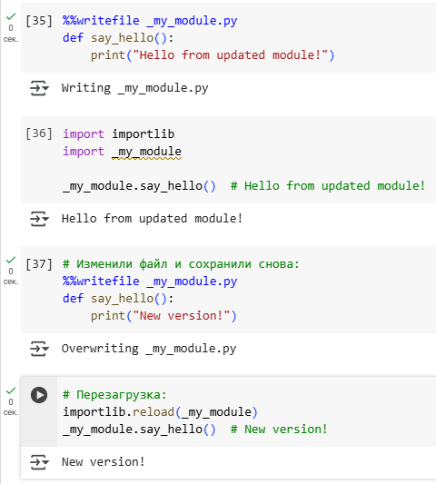

# 4 - Импорт, модули, пакеты, области видимости переменных

## Список тем:

- **Области видимости переменных:** LEGB, `global`, `nonlocal`, Scope v/s Namespace, `globals()`, `dir()`, `locals()`, `if __name__ is '__main__'`, компиляция  
- **Other**: "моржик", `func.__code__.co_varnames`,  
- **Замыкания (closure)**: что такое, примеры, где хранятся? Почему о них идёт речь? `free variables`, достаньте замыкание: имя и значение.
- **Импорт**:` __init__.py`, `__all__` & `non public` сущности , `__import__`, абсолютные и относительные, где лежат используемые библиотеки? `sys.modules`  
- **APT/python-apt, PIP**: где лежат используемые библиотеки? `apt.Cache()`: /var/cache/apt/archives/; `cache.update()`: /etc/apt/sources.list, /var/lib/apt/lists/; Установка пакетов, подсчёт их количества; /usr/lib/python3.10 v/s /usr/lib/python3/dist-package v/s /usr/local/lib/python3.10/dist-packages; как посмотреть локацию модуля из RunTime; `__pycache__`; pip и gcc; pip и cache ~/.cache/pip; `!pip show pip`; `!pip list`; `pip cache purge`; `pip install module_name --no-cache-dir`;  
- **Интерактивный интерпретатор и GoogleColab (GCo)**: запустите интерактивный Python-интерпретатор из GCo.  
- **sys:** путь к исполняемому файлу; `sys.argv`; `sys.exit()`; `sys.path` & `sys.modules`; `sys.version`; `sys.version_info`: `major`, `minor`, `micro`, `releaselevel`, `serial`; `sys.platform`; `sys.modules`: `sys.modules['math']` v/s `sys.modules['pandas']`, `sys.modules` & `import`; `sys.getsizeof(object)` v/s `object.__sizeof__()`; `sys.getrefcount(object)`;  
- **Modules**: `builtins` & `__builtin__` & `__builtins__`, importlib. Как посмотреть версию модуля? `__name__ ` 
- **importlib**: `.reload(...)` & `sys.modules`, `%%writefile _my_module.py` & `.import_module('...')` & `sys.modules`
- **Структура проекта:** `__init__.py`, `__all__`, `__doc__`, `__annotations__`
___________

## Область видимости переменных

**Области видимости (scope) и пространства имен (namespace)** – концепции по управлению переменными и их видимостью.

### Scope

**Scope** – определяет, в каких частях программы переменная доступна для использования:
- **Local** – переменные, объявленные в функции. Видимы только внутри этой функции.
- **Enclosed** – переменные из внешних (но не глобальных) функций: вложенные функции.
- **Global** – переменные, доступные во всем модуле.
- **Built-in** – переменные, предопределенные Python.

**LEGB** – модель, по которой осуществляется поиск переменной.

Рассмотрим пример для наглядности:

```Python
x = "global"

def outer_func():
    x = "enclosed"

    def inner_func():
        x = "local"
        print(x)

    inner_func()

outer_func() # local
```

`x` определена на трех уровнях: Global, Enclosed и Local.

Вызов `inner_function()`, поиск `x`:
1. *в Local*: внутри `inner_function`
2. *в Enclosed*: внутри `outer_function`
3. *в Global*

*Также можем задать больший scope переменной из* подпространства.
В примере: `global` x говорит, что x внутри ф-и ссылается на глобальную переменную.

```Python
x = "global"

def change_global():
    global x
    x = "modified global"

change_global()
print(x) # modified_global
```

*Также можем задать больший scope переменной из* подпространства.
В примере: `nonlocal` x изменяет значение x в области видимости `outer_function`.

```python
def outer_func():
    x = "enclosed"

    def inner_func():
        nonlocal x
        x = "modified enclosed"

    inner_func()
    print(x)

outer_func() # modified enclosed
```

Вот демонстрация для всего блока про Scopes:

```Python
def scope_test():  
    def do_local():  
        spam = "local spam"  
  
    def do_nonlocal():  
        nonlocal spam  
        spam = "nonlocal spam"  
  
    def do_global():  
        global spam  
        spam = "global spam"  
  
    spam = "test spam"  
    do_local()  
    print("After local assignment:", spam)  
    do_nonlocal()  
    print("After nonlocal assignment:", spam)  
    do_global()  
    print("After global assignment:", spam)  
  
scope_test()  
print("In global scope:", spam)
```
```output
After local assignment: test spam
After nonlocal assignment: nonlocal spam
After global assignment: nonlocal spam
In global scope: global spam
```

### Namespace

**namespace** — отображение имен (например, переменных и функций) на объекты. Можно думать о namespace как о словаре, где ключами являются имена переменных, а значениями — их данные. *Namespaces* создаются в следующих случаях:
- Когда **загружается модуль**: создается *глобальное namespace*.
- Когда **вызывается функция**: создается *локальное namespace*.
- Когда **интерпретатор запускается**: создается *встроенное namespace*.

*В примере:* переменная `a` находится в **global namespace** и доступна из ф-и, тогда как `b` существует только внутри функции: **local namespace**.
```Python
a = 5  
  
def my_function():  
    b = 10  
    print(a)  
  
my_function()  # 5
print(b) # NameError: name 'b' is not defined
```

### `scopes()`, `globals()`, `dir()`

Функция **globals()** возвращает словарь всех переменных в глобальной области видимости текущего модуля.
Функция **dir()** возвращает список всех доступных имён в текущей области видимости или атрибутов объекта, если передан аргумент.
Функция **locals()** возвращает словарь локальных переменных текущей области видимости.

```Python
x = 42  
y = 'hello'  
  
def demo_scope(a, b):  
    local_var = a + b  
    hidden = "secret"  
  
    print("=== LOCALS ===")  
    for name, value in locals().items():  
        print(f"{name} -> {value}")  
  
    print("\n=== GLOBALS ===")  
    print(f"x in globals: {'x' in globals()}")  
    print(f"y in globals: {'y' in globals()}")  
    print(f"local_var in globals: {'local_var' in globals()}")  
  
    print("\n=== DIR ===")  
    print("Available names:", dir())  
  
demo_scope(10, 5)
```
```output
=== LOCALS ===
a -> 10
b -> 5
local_var -> 15
hidden -> secret

=== GLOBALS ===
x in globals: True
y in globals: True
local_var in globals: False

=== DIR ===
Available names: ['a', 'b', 'hidden', 'local_var', 'name', 'value']
```

### `if __name__ == '__main__'`

Конструкция `if __name__ == '__main__'`: проверяет, запущен ли модуль как основной файл, а не импортирован. Переменная __name__ равна "__main__" , если модуль запущен напрямую.
### Компиляция

*Компиляция в Python* – это процесс преобразования исходного кода в байт-код ( .pyc - файлы), который затем исполняется виртуальной машиной Python (PVM). Компиляция происходит автоматически при запуске или импорте модуля.

_____________
## Оператор "моржик" и `func.__code__.co_varnames`

Оператор `:=` , известный как "моржик", позволяет присваивать значение переменной внутри выражения. (Доступен с Python 3.8.)

```Python
WALRUS = "I am the walrus, goo goo goo joob"  
  
if (n := len(WALRUS)) > 3:  
    print(n)  # 33
    print("I am the walrus, goo goo goo joob goo goo goo joob")
```
	from song "I Am the Walrus" by The Beatles


Атрибут `func.__code__.co_varnames` возвращает кортеж имён всех локальных переменных функции.

```Python
def foo(a, b):  
    c = a + b  
    return c  
  
print(foo.__code__.co_varnames) # ('a', 'b', 'c')
```

_______________
## Замыкания (closure)

**Замыкание (closure)** — это функция, которая сохраняет доступ к переменным из своей окружающей области видимости (другая функция), даже после того, как эта другая функция завершила выполнение.
Замыкания создаются, когда вложенная функция сохраняет ссылки на переменные (использует их), которые не определены внутри нее, но доступны в ее вложенной области видимости.

```Python
def outer_function(msg):
    # msg из области видимости outer_function
    def inner_function():
        print(msg)
    return inner_function

my_closure = outer_function("Hello, Closure!")
my_closure() # Hello, Closure!
```
	 Переменная msg доступна для inner_function, несмотря на то, что outer_function уже завершилась.

*Замыкания полезны для создания функций с "памятью"*, используются в декораторах, фабриках функций и для инкапсуляции данных.

**Чем опасны замыкания?**
- Сложно уследить, что функция утаскивает в своё замыкание и где обитают переменные, попавшие в замыкание функции.
- Утечка памяти: можем в scope хранить большие объекты и они не будут удалены, пока не будет уничтожено замыкание.

### Где хранятся?

Замыкания хранятся в атрибуте `__closure__` функции, который содержит кортеж объектов cell с "свободными переменными" – free variables.

```Python
print(my_closure.__closure__)  # (<cell at 0x00000205BBC10610: str object at 0x00000205BBC43AF0>,)
print(my_closure.__closure__[0].cell_contents) # Hello, Closure!
```

Свободные переменные (free variables) — это переменные, которые используются в замыкании, но определены во внешней функции.
```Python
print(my_closure.__code__.co_freevars) # ('msg',)
```

### Как достать имя и значение замыкания?

Из прошлого пункта помним:
- `func.__code__.co_freevars` — кортеж имён свободных переменных (т.е. *имена переменных*, которые используются внутри, но определены снаружи).
- `func.__closure__` — кортеж *cell-объектов*, каждый из которых содержит значение соответствующей переменной.
```Python
def outer_function(msg):  
    # msg из области видимости outer_function  
    def inner_function():  
        print(msg)  
    return inner_function  
  
my_closure = outer_function("Hello, Closure!")  

name = my_closure.__code__.co_freevars[0]  
value = my_closure.__closure__[0].cell_contents  
  
print(f"{name} = {value}") # msg = Hello, Closure!
```

Имена и значения идут **в одинаковом порядке** в этих двух структурах, поэтому можно использовать `zip()`.

```Python
for name, cell in zip(my_closure.__code__.co_freevars, my_closure.__closure__):
    print(f"{name} = {cell.cell_contents}")
```

_______
## Импорт

Файл `__init__.py` делает директорию пакетом Python, позволяя импортировать модули из неё. Может быть пустым или содержать код инициализации.

### `__all__`

**`__all__`** — это список строк, определяющий, какие имена будут импортированы из модуля при использовании конструкции `from module import *`.

- Если `__all__` **не указан**, то по умолчанию импортируются *все имена, не начинающиеся с символа подчёркивания `_`* (то есть считающиеся публичными).  Функции или переменные с именами на `_` считаются приватными (*non public*) и не будут импортированы.
- Если `__all__` **прописан**, то `from module import *` импортирует *только те имена, которые указаны в этом списке*, даже если они начинаются с `_`.

```Python
# my_module.py

__all__ = ['public_function', '_private_function']

def public_function():
    pass

def another_function():
    pass

def _private_function():
    pass

```
```Python
from my_module import *
# Будут импортированы:
# public_function и _private_function
# another_function — НЕ будет импортирована, потому что не входит в __all__
```

### `__import__`

Функция `__import__` используется для динамического импорта модулей.

```Python
math = __import__("math")  
print(math.sqrt(16)) # 4.0
```

### Absolute & Relative imports

#### Абсолютный импорт

**Абсолютный импорт** указывает *полный путь к модулю или пакету, начиная с корневой директории проекта*.

Примеры абсолютных импортов:
```
project/
├── package1/
│   ├── __init__.py
│   ├── module1.py
│   └── module2.py
└── package2/
    ├── __init__.py
    ├── module3.py
    ├── module4.py
    └── subpackage1/
        └── module5.py
```

- `package1/module2.py` содержит функцию `function1`
- `package2/__init__.py` содержит класс `Class1`
- `package2/subpackage1/module5.py` содержит функцию `function2`

```python
from package1 import module1
from package1.module2 import function1
from package2 import Class1  # from __init__.py
from package2.subpackage1.module5 import function2
```

***Преимущества и недостатки абсолютных импортов:***
- **Ясность и понятность**: По импортируемому пути сразу понятно, откуда берётся модуль.
- **Надёжность**: Абсолютные импорты остаются корректными, даже если текущий модуль перемещается в другую директорию.
- **Рекомендовано PEP 8**: Абсолютные импорты считаются лучшей практикой в Python.

- ***Многословность***: В проектах с глубокой структурой каталогов импорты могут стать очень длинными.
```python
from package1.subpackage2.subpackage3.subpackage4.module5 import function6
```

#### Относительный импорт

**Относительный импорт** указывает *путь к модулю или пакету относительно текущего модуля, используя точечную нотацию.*

- **Одна точка** (`.`) обозначает текущую директорию модуля, используя точечную нотацию.
- **Две точки** (`..`) обозначают родительскую директорию.
- **Три точки** (`...`) — директорию на два уровня выше, и так далее.

**Примеры относительных импортов:**

```
project/
├── package1/
│   ├── __init__.py
│   ├── module1.py
│   └── module2.py
└── package2/
    ├── __init__.py
    ├── module3.py
    ├── module4.py
    └── subpackage1/
        └── module5.py
```

```python
# package1/module1.py
from .module2 import function1  # Импорт из того же пакета
```
Импортируем одну точку, так как `module2.py` находится в той же директории, что и `module1.py`.

```python
# package2/module3.py
from .module4 import class1  # Если class1 определён в module4.py
from ..package1.module2 import function1  # OK, но требует запуска как пакета
```
Запуск как пакета: `python -m package2.module3`

```python
# package2/subpackage1/module5.py
from ..package1.module1 import use_function2 
```

**Преимущества и недостатки относительных импортов:**
- **Гибкость**: изменения имён верхних модулей не приведёт к ошибкам и не нужно коммитить изменения в git.
- ***Перемещение файла в другую директорию*** скорее всего приведёт к ошибке импорта, т.к. нужного файла не будет.

#### Итого:

**Абсолютные импорты:**
- **Используйте**, когда важно явное указание местоположения модуля.
- **Предпочтительны** в большинстве случаев, особенно в крупных проектах.
- **Легче понять и отследить** зависимости.

**Относительные импорты:**
- **Полезны** для внутренних модулей пакета, когда не планируется использовать пакет вне проекта.
- **Сокращают длину** импортов в глубоко вложенных структурах.
- **Будьте осторожны** при изменении структуры каталогов, так как импорты могут стать некорректными.

### Где лежат загруженные библиотеки?

- `/usr/lib/python3.10` – стандартные библиотеки. 
- `/usr/lib/python3/dist-packages` – пакеты, установленные через APT. 
- `/usr/local/lib/python3.10/dist-packages` – пакеты, установленные через PIP.

### sys.modules

**`sys.modules`** – это *словарь всех загруженных модулей в текущей сессии*.

```Python
import sys  
import math  
   
print(sys.modules['math'])
```
```output
<module 'math' (built-in)>
```
___
## APT, PIP


- **`APT`** — системный менеджер пакетов Debian/Ubuntu. Устанавливает **системные** Python-библиотеки через `.deb`-пакеты.
	- `python-apt` — Python-интерфейс к APT, позволяет программно управлять пакетами из Python.
- **`pip`** — менеджер **Python-пакетов из PyPI**.
	- Устанавливает библиотеки в **Python-окружение**, независимо от APT.

### Где лежат используемые библиотеки? /usr/lib/python3.10 v/s /usr/lib/python3/dist-package v/s /usr/local/lib/python3.10/dist-packages

|Путь|Кто использует|Назначение|
|---|---|---|
|`/usr/lib/python3.x/`|Python core|Стандартная библиотека|
|`/usr/lib/python3/dist-packages/`|APT (`apt`, `apt-get`)|Системные пакеты, установленные через `.deb`|
|`/usr/local/lib/python3.x/dist-packages/`|`pip` (без venv)|Сторонние пакеты, установленные через `pip`|
|`~/.local/lib/python3.x/site-packages/`|`pip install --user`|Локальные (пользовательские) установки|
|`venv/.../site-packages/`|Виртуальное окружение|Когда используется `venv` или `virtualenv`|
#### Как посмотреть локацию модуля из RunTime:
```Python
import some_module
print(some_module.__file__)
```

### **Работа с `python-apt`**

####  `apt.Cache()`: /var/cache/apt/archives/

`apt.Cache()` предоставляет доступ к кэшу установленных и доступных пакетов, который хранится в /var/cache/apt/archives/ .

#### `cache.update()`: /etc/apt/sources.list, /var/lib/apt/lists/

Метод cache.update() обновляет кэш APT, загружая данные из репозиториев, указанных в /etc/apt/sources.list . Метаданные сохраняются в /var/lib/apt/lists/ .

```Python
import apt 
cache = apt.Cache()       # Объект кэша доступных пакетов 
cache.update()            # Обновляет списки пакетов (эквивалент apt update`)
```

***Файлы, с которыми работает `APT`:***

|Файл / папка|Назначение|
|---|---|
|`/var/cache/apt/archives/`|Кэш загруженных `.deb` пакетов|
|`/var/lib/apt/lists/`|Распакованные списки пакетов из источников|
|`/etc/apt/sources.list`|Список источников (репозиториев)|

#### Пример: посчитать количество установленных пакетов через `python-apt`:

```Python
installed = [pkg for pkg in cache if pkg.is_installed] 
print(len(installed))
```

### Через консоль

***Установка пакетов***:
- **APT**: `sudo apt install python3-package`
- **PIP**: `pip install package`

***Посчитать количество:***
- **APT**: `dpkg -l | grep '^ii' | wc -l` – количество установленных пакетов
- **PIP**: `pip list | wc -l` – количество установленных Python-пакетов

### Работа с `pip`

#### **`pip` и `gcc`**

- Некоторые Python-пакеты (например, `numpy`, `lxml`, `psycopg2`) требуют **сборки из исходников**.
- В таком случае `pip` вызывает `gcc`, чтобы собрать C-расширения.
- Для этого должны быть установлены:
    - компилятор (`build-essential`, `gcc`, `g++`)
    - `python3-dev` или `python3.x-dev`

#### `__pycache__`

- Директория, в которую Python компилирует `.py` файлы в `.pyc` (байткод).
- Располагается рядом с исходными модулями:
```
├── ...
├── mymodule.py 
├── __pycache__/mymodule.cpython-310.pyc
```

- Это **ускоряет импорт**, потому что компилировать при следующем запуске не нужно.

#### Команды

- `!pip show <module>` – посмотреть информацию о модуле
- `!pip list` – список всех модулей

**PIP** кэширует скачанные пакеты в ***~/.cache/pip*** для повторного использования.
- `pip cache purge` – очистить кэш
- `pip install <module> --no-cache-dir` – установка без кэша


_________
## Интерактивный интерпретатор и GoogleColab (GCo): запустите интерактивный Python-интерпретатор из GCo

**Интерактивный интерпретатор Python** — это режим, в котором команды выполняются сразу после ввода. Такой режим удобен для тестирования кода, отладки и работы с данными «на лету». Обычно он запускается в терминале с помощью команды:

```bash
python
```

или в интерактивном режиме (можно использовать/тестить функции из модуля):
```bash
python -i script.py
```

Пример:
```Python
# utils.py
def add(a, b):
    return a + b

def mul(a, b):
    return a * b

msg = "Hello from utils!"
```
```bash
python -i utils.py
```
```Python
>>> add(2, 3)
5
>>> mul(4, 5)
20
>>> msg
'Hello from utils!'
```

В Google Colab прямой запуск интерактивного интерпретатора через `!python -i` невозможен, так как Colab работает на основе Jupyter Notebook, где код исполняется по ячейкам, а не в полноценной интерактивной сессии.

Однако поведение интерпретатора можно частично эмулировать с помощью конструкции `input()` и `exec()`:

```Python
# В ячейке Colab
while True:
 code = input(">>> ")
 if code == "exit":
  break
 exec(code)
```
```
>>> import numpy as np
>>> l = np.array([1, 2, 3]) 
>>> print(l)
[1 2 3] 
>>> l += 3 
>>> print(l) 
[4 5 6]
>>> exit
```

_________
## sys

Модуль `sys` — системные функции и свойства Python

* **`sys.executable`** – путь к исполняемому Python-интерпретатору  
  ```python
  import sys
  print(sys.executable)
  ```

* **`sys.argv`** – список аргументов командной строки  
  ```python
  print(sys.argv)  # ['script.py', 'arg1', 'arg2']
  ```

* **`sys.exit([code])`** – завершает выполнение программы с кодом выхода (по умолчанию 0)  
  ```python
  sys.exit(1)
  ```

* **`sys.path`** – список путей, где Python ищет модули  
* **`sys.modules`** – словарь загруженных модулей (`имя модуля → объект`)  
  ```python
  print(sys.path)
  print(sys.modules)
  ```
```Python
import math
print(sys.modules['math'])
```

* **`sys.version`** – строка с полной информацией о версии Python  
  ```python
  print(sys.version)  # '3.10.12 (main, ...'
  ```

* **`sys.version_info`** – кортеж с деталями версии: `(major, minor, micro, releaselevel, serial)`  
  ```python
  print(sys.version_info)  # (3, 10, 12, 'final', 0)
  ```

* **`sys.platform`** – строка с названием платформы (`'linux'`, `'win32'`, `'darwin'` и др.)  
  ```python
  print(sys.platform)
  ```

* **`sys.getrefcount(obj)`** – количество ссылок на объект (всегда как минимум 2: локальная + внутренняя)  
  ```python
  a = []
  print(sys.getrefcount(a))  # обычно 2
  ```

### `getsizeof() `v/s `__sizeof__()`

* **`sys.getsizeof(obj)`** – возвращает полный размер объекта в байтах, включая накладные расходы
  ```python
  a = [1, 2, 3]
  print(sys.getsizeof(a))  # например, 88
  ```

* **`obj.__sizeof__()`** – возвращает «чистый» размер объекта без ссылок  
  ```python
  print(a.__sizeof__())  # например, 64
  ```

### `sys.modules['math']` vs `sys.modules['pandas']`

```Python
import math, pandas
print(sys.modules['math'])    # встроенный модуль
print(sys.modules['pandas'])  # внешний (если импортирован)
```
```output
<module 'math' (built-in)>
<module 'pandas' from '...\.venv\\Lib\\site-packages\\pandas\\__init__.py'>
```

__________
## Modules

###  `builtins` & `__builtin__` & `__builtins__`

- `builtins` – модуль со встроенными функциями и исключениями. 
- `__builtin__` – устаревшее имя в Python 2. 
- `__builtins__` – ссылка на модуль builtins в текущей области.

```Python
import builtins 
print(builtins.print)
```

### importlib

 `importlib` — работа с импортами программно. Позволяет импортировать модули динамически, перезагружать их, узнать путь и др.

```Python
import importlib

mod = importlib.import_module('math')
print(mod.sqrt(16))  # 4.0

# Перезагрузка модуля (например, после изменений)
importlib.reload(mod)
```

#### Как узнать версию модуля?

```Python
import numpy
print(numpy.__version__)
```

Если же использовать средства `importlib`: в `importlib.metadata` есть функция `version()`

```Python
from importlib.metadata import version
print(version("numpy"))
```

### `__name__`

`__name__` — имя текущего модуля:

- Если скрипт выполняется напрямую: `__name__ == '__main__'`
- Если импортирован как модуль: `__name__ == 'module_name'`

```Python
# script.py
def func(): ...

if __name__ == '__main__':
    func()

```

_________
## importlib

|Метод|Назначение|
|---|---|
|`importlib.reload(module)`|Перезагружает уже импортированный модуль|
|`importlib.import_module(name)`|Импортирует модуль по строке|
|`sys.modules`|Хранилище всех загруженных модулей|
|`%%writefile`|Сохраняет код в файл (актуально для Jupyter/Colab)|

### `importlib.reload(module)` & `sys.modules`

`importlib.reload()` принудительно *перезагружает уже импортированный модуль*.
- Используется, если изменилось содержимое `.py`-файла во время работы скрипта / интерактивной сессии.
- Перезагрузка работает *только с уже импортированными модулями*, т.е. те, что есть в `sys.modules`.

```Python
import my_module
import importlib

importlib.reload(my_module)  # Перезагрузка my_module
```

### `%%writefile _my_module.py` & `.import_module('...')` & `sys.modules`

`importlib.import_module('module_name')` – альтернатива `import`, позволяет *динамически импортировать по имени из строки*.

```Python
import importlib

mod = importlib.import_module('math')
print(mod.sqrt(25))  # 5.0
```

`%%writefile` – Jupyter-команда для создания файла.

Пример: сценарий для такой комбинации:

```Python
%%writefile _my_module.py
def say_hello():
    print("Hello from updated module!")
```
```Python
import importlib
import _my_module

_my_module.say_hello()  # Hello from updated module!
```
```Python
# Изменили файл и сохранили снова:
%%writefile _my_module.py
def say_hello():
    print("New version!")
```
```Python
# Перезагрузка:
importlib.reload(_my_module)
_my_module.say_hello()  # New version!
```



____
#### Зачем это вообще надо?

Этого вопроса не было в билете, я сам поинтересовался.

- **разработке / тестировании** (не перезапускать весь интерпретатор);
- **горячей подгрузке плагинов / модификаций**;
- **импортировании модулей по имени из строки** (динамика, не хардкодить `import`);
- **чистке или подмене модулей** (например, в рантайме или при тестах).
  
Пример 1: **Быстрая перезагрузка при локальной разработке**
```Python
# dev_script.py
import my_plugin
import importlib

while True:
    cmd = input(">>> ")
    if cmd == "reload":
        importlib.reload(my_plugin)
    else:
        my_plugin.run(cmd)
```
Можно менять `my_plugin.py` и тестировать без выхода из программы.

Пример 2: **Мокирование в тестах**

В тестах можно подменять или сбрасывать модули:
```Python
sys.modules['os'] = mock_os
importlib.reload(my_module)  # теперь my_module будет использовать mock_os
```

__________
## Структура проекта

`__init.py__` – файл, обозначающий пакет Python. 
`__all__`–  список имён для импорта через `*` . 
`__doc__` – документационная строка модуля.

```Python
"""
Это документация модуля
"""

print(__doc__)
```

`annotations` – словарь аннотаций типов.

```Python
def foo(a: int) -> str:  
    pass  
print(foo.__annotations__) # {'a': <class 'int'>, 'return': <class 'str'>}
```
