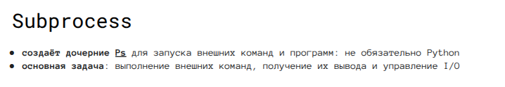
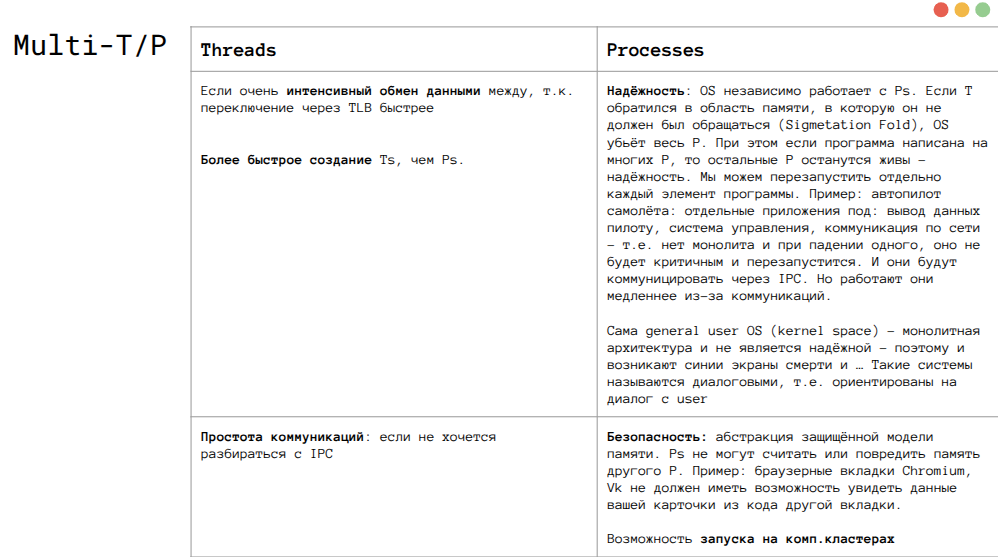

[source](https://docs.google.com/presentation/d/1TX3f4aXW07mOcRB3nrW7_cC7Jzsa5nJ1oZRhPufFYII/edit?slide=id.g346642ea1e6_0_84#slide=id.g346642ea1e6_0_84)

## Process
Для каждого процесса:
- Отдельное виртуальное адресное пространство (виртуальная память для процесса непрерывна)

**Виртуальная память** - набор блоков памяти фиксированного размера (pagex x86j-64 4kb/2mb/1gb)

**Page** - абстракция, непрерывный блок фиксированного размера с последовательными данными
Адрес page = page number + смещение внутри page

page table 
- может отображать виртуальный адрес в физический адрес в RAM 
- управляется OS
- Отдельная для каждого процесса
- ключевой механизм изоляции между процессами

Каждый процесс в OS имеет:
- хотя бы один T, где T - единица планирования OS
- отношение Предок-Потомок 
- У T нет родственных связей

